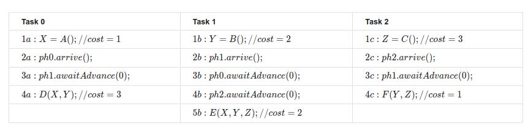

## 4.1 Lecture Summary
### 4 Dataflow Synchronization and Pipelining
#### 4.1 Split-phase Barriers with Java Phasers

Lecture Summary: In this lecture, we examined a variant of the barrier example that we studied earlier:

````
    forall (i : [0:n-1]) { 
        print HELLO, i;
        myId = lookup(i); // convert int to a string 
        print BYE, myId;
    }
````
We learned about Java’s Phaser class, and that the operation **ph.arriveAndAwaitAdvance()**, can be used to implement a barrier 
through phaser object **ph**. We also observed that there are two possible positions for inserting a barrier between the two 
print statements above — before or after the call to **lookup(i)**. However, upon closer examination, we can see that the 
call to **lookup(i)** is local to iteration i and that there is no specific need to either complete it before the barrier or 
to complete it after the barrier. In fact, the call to **lookup(i)** can be performed in parallel with the barrier. 
To facilitate this split-phase barrier (also known as a fuzzy barrier) we use two separate APIs from Java Phaser class — 
**ph.arrive()** and **ph.awaitAdvance()**. Together these two APIs form a barrier, but we now have the freedom to insert a 
computation such as **lookup(i)** between the two calls as follows:

````
// initialize phaser ph	for use by n tasks ("parties") 
Phaser ph = new Phaser(n);
// Create forall loop with n iterations that operate on ph 
forall (i : [0:n-1]) {
  print HELLO, i;
  int phase = ph.arrive();
  
  myId = lookup(i); // convert int to a string

  ph.awaitAdvance(phase);
  print BYE, myId;
}
````

Doing so enables the barrier processing to occur in parallel with the call to **lookup(i)**, which was our desired outcome.

Optional Reading:

1. Documentation on Java’s [Phaser](https://docs.oracle.com/javase/7/docs/api/java/util/concurrent/Phaser.html) class.


## 4.2 Lecture Summary
### 4 Dataflow Synchronization and Pipelining
#### 4.2 Point-to-Point Synchronization with Phasers

Lecture Summary: In this lecture, we looked at a parallel program example in which the span (critical path length) 
would be 6 units of time if we used a barrier, but is reduced to 5 units of time if we use individual phasers as shown 
in the following table:



Each column in the table represents execution of a separate task, and the calls to arrive(){\tt arrive()}arrive() and awaitAdvance(0){\tt awaitAdvance(0)}awaitAdvance(0) represent synchronization across different tasks via phaser objects, ph0{\tt ph0}ph0, ph1{\tt ph1}ph1, and ph2{\tt ph2}ph2, each of which is initialized with a party count of 1 (only one signalling task). (The parameter 0 in awaitAdvance(0){\tt awaitAdvance(0)}awaitAdvance(0) represents a transition from phase 0 to phase 1.)

Optional Reading:

1. Documentation on Java Phaser class.